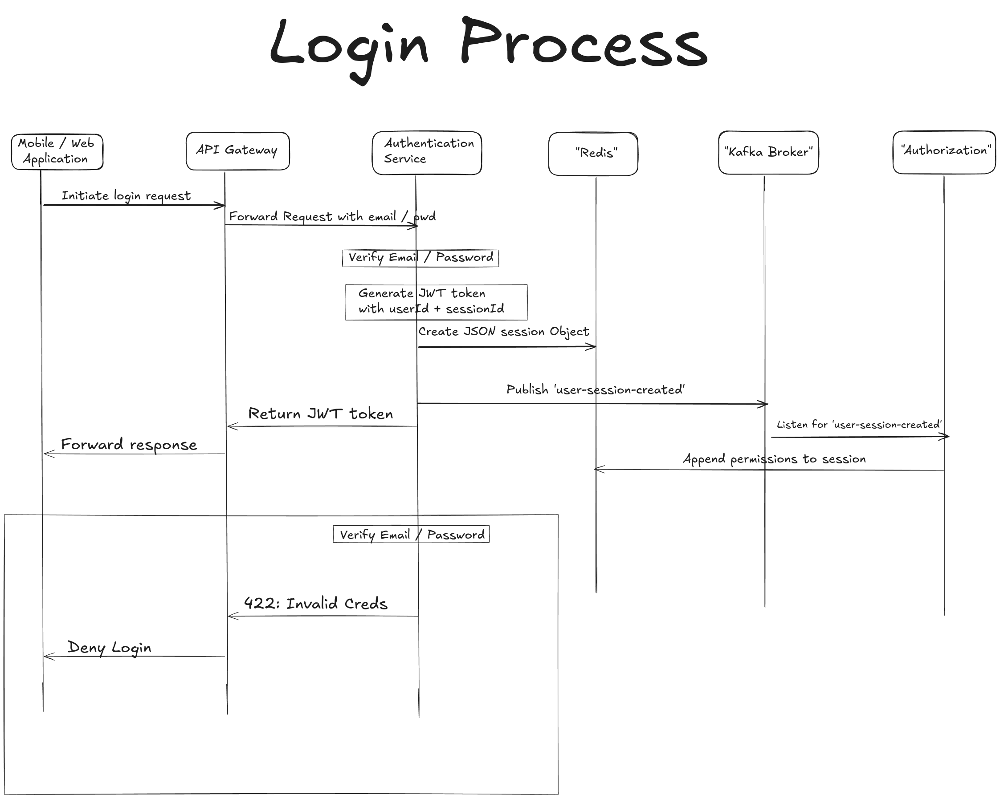
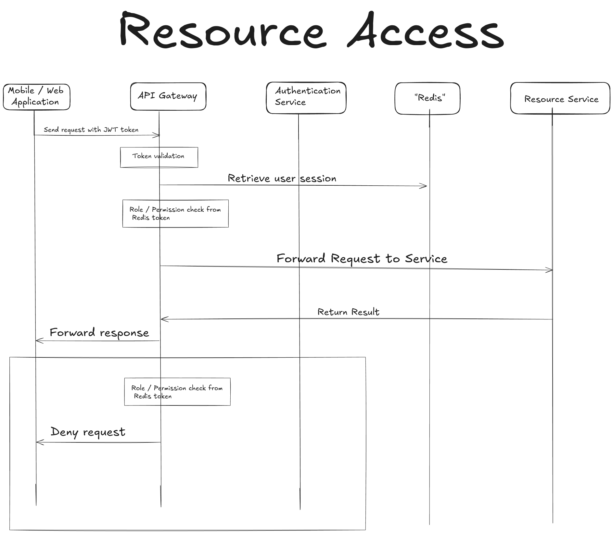

# Backend API in NestJS

## Login

Will implement SSO login ( FB, Insta ), the login process schema will evolve

## Workout Service / Recipes Service

Should implement Authorization on resource / service as well ( 2 layers of authorization )

## Docker compose

FYI : do not use the certs in the `_docker/certs/` folder. They are here only for testing purpose. I wanted my local env to be as close as a production env.
